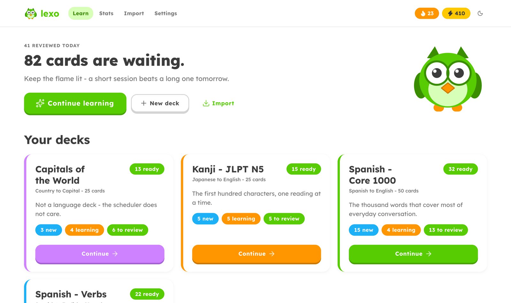
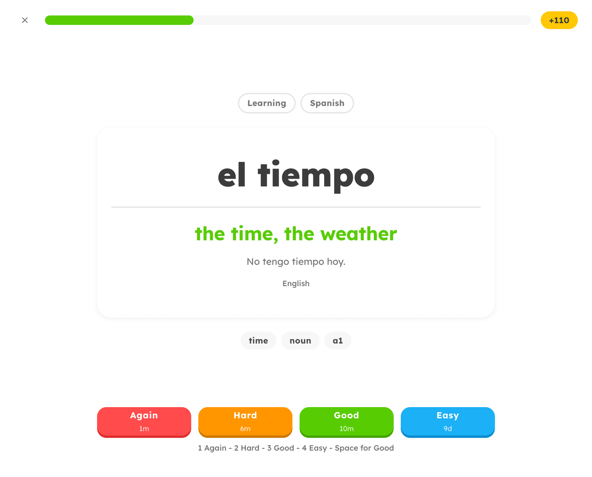
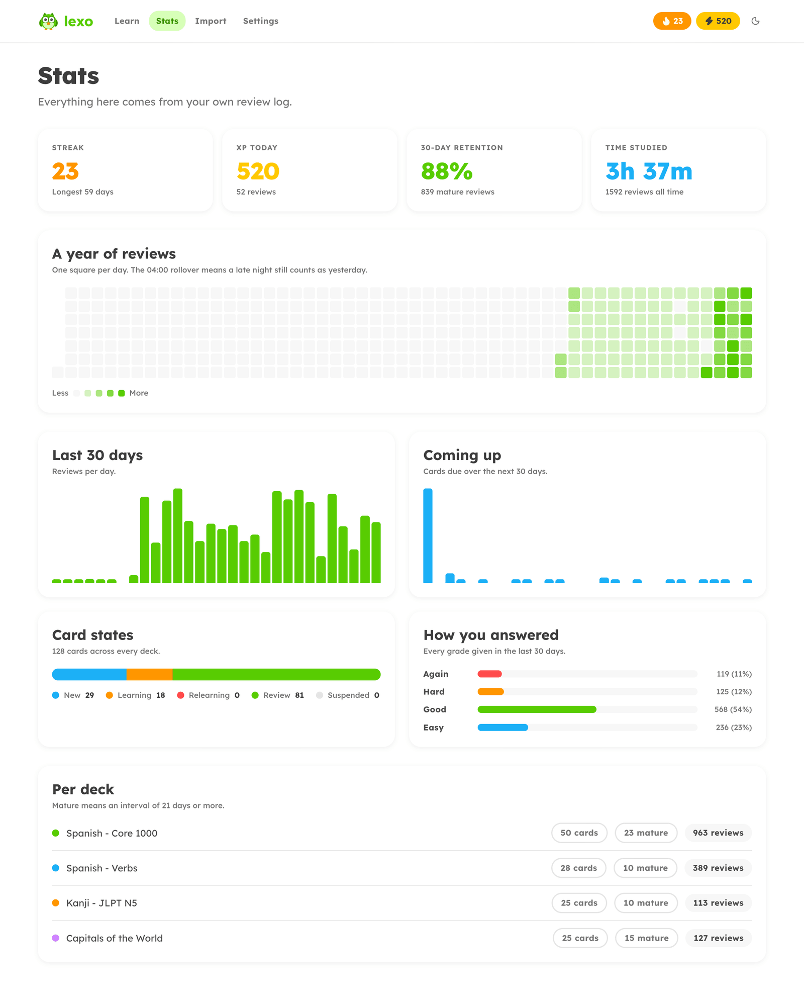
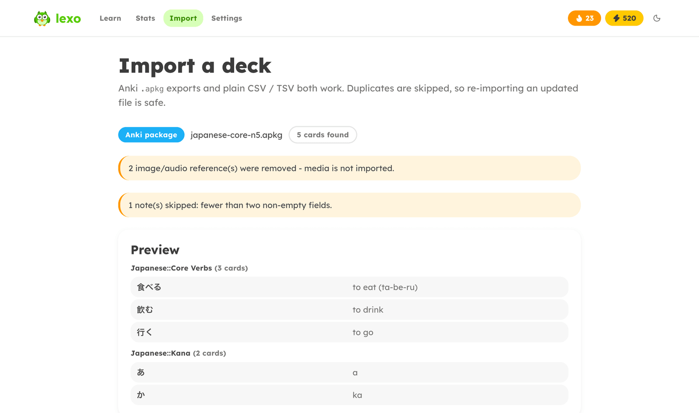
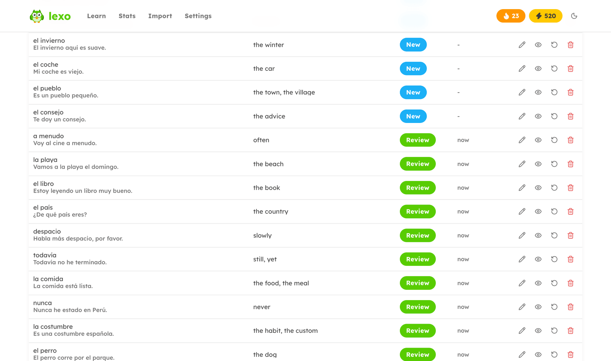
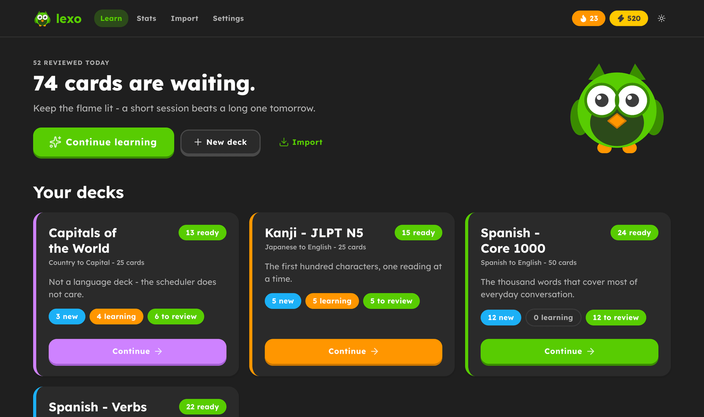

<div align="center">


# lexo

**Self-hosted spaced repetition that works in any language.**

FSRS scheduling, Anki and CSV import, and study stats that come straight from
your own review log - all in a single SQLite file you own.

[](https://github.com/rixcian/lexo/actions/workflows/docker-publish.yml)
[](https://github.com/rixcian/lexo/pkgs/container/lexo)
[](https://nextjs.org)
[](https://github.com/open-spaced-repetition/ts-fsrs)

</div>



---

## What it is

A flashcard app for one person and one server. A deck is nothing more than a
front, a back and two free-form language labels, so Spanish vocabulary, kanji
readings and world capitals all sit side by side under the same scheduler.

- **FSRS, the algorithm modern Anki defaults to.** Four grades, learning steps
  replayed inside the session, per-deck daily caps.
- **Import what you already have.** Anki `.apkg` exports and plain CSV/TSV,
  images and audio included, with duplicate detection so re-importing an
  updated file is safe.
- **Take it back out.** Any deck exports as an `.apkg` Anki can open, or as
  CSV.
- **Stats from the raw review log.** Nothing is cached or denormalised, so the
  numbers are always the truth.
- **Installable as a PWA.** Manifest, maskable icons, offline shell.
- **One file to back up.** No Postgres, no Redis, no account, no cloud.

## Quick start

```bash
docker run -d --name lexo -p 3000:3000 \
  -e TZ=Europe/Prague \
  -v lexo-data:/data \
  ghcr.io/rixcian/lexo:latest
```

Open <http://localhost:3000>. Migrations run on first boot; there is nothing
else to configure.

Prefer compose? [`docker-compose.portainer.yml`](docker-compose.portainer.yml)
is ready to paste into Portainer's web editor.

> Set `TZ` to your own timezone. The study day rolls over at 04:00 local time,
> and your streak depends on it.

## Screenshots

**Reviewing.** Four grades, each carrying the interval it would schedule.
`Space` flips, `1`-`4` grade, and a card that comes due again within twenty
minutes returns later in the same session.



**Stats.** A year of activity, the next thirty days of workload, where your
cards sit in their lifecycle, and how you actually answered.



<table>
<tr>
<td width="50%">

**Import** - deck hierarchy, HTML flattening, and an honest account of what was
dropped.

</td>
<td width="50%">

**Browse** - every card, searchable, with edit, suspend, reset and delete in
reach.

</td>
</tr>
<tr>
<td></td>
<td></td>
</tr>
</table>

**Dark mode**, following the brand's published dark guidance - because a study
app gets used in bed.



## Importing decks

**CSV / TSV** needs only a front and a back column; `extra` and `tags` are
optional, and so is the header row. The separator, header flag and column
mapping can all be corrected in the UI after uploading. There is a sample at
[`examples/spanish-starter.csv`](examples/spanish-starter.csv).

```csv
front,back,extra,tags
el perro,the dog,El perro corre por el parque.,animals noun
```

**Anki `.apkg`** works for both the plain-SQLite collections
(`collection.anki2`, `collection.anki21`) and the zstd-compressed
`collection.anki21b` written by modern Anki. Deck hierarchy is preserved as
`Parent::Child`, field HTML is flattened to text, and each deck in the package
can become its own deck here or be merged into one.

**Images and audio come along.** `` tags and `[sound:…]` references are
pulled out of the package and attached to the field they came from, for both
the legacy JSON media manifest and the protobuf one modern Anki writes. A card
whose front is only a picture is imported as a picture card rather than
skipped, and the preview says how many files the package brings before you
commit to it.

Not imported: note templates and the original scheduling history - every
imported card starts as New under this app's own scheduler.

Imports are idempotent. A note is fingerprinted on its normalised front and
back plus the content hashes of its front and back media, so re-importing an
updated file adds only what is new, and a picture deck whose cards share no
text still deduplicates correctly.

Deck files are capped at **100 MB**; see `ANKI_MAX_UPLOAD_MB` under
[Configuration](#configuration). The upload goes to `POST /api/import` rather
than a server action precisely so that stays tunable - an action's body cap
lives in `next.config.ts`, which `next build` freezes into the standalone
bundle, and a prebuilt image could never be re-tuned from its environment.

## Exporting decks

Every deck can be taken back out, from its settings page.

**`.apkg`** writes a schema 11 package: the last collection format that is
plain SQLite rather than protobuf, and the one Anki still accepts and upgrades
on the way in. It carries the notes, tags, a three-field note type with one or
two card templates (matching the deck's own reverse setting), the media files,
and the full review log.

Scheduling is the lossy part. Anki's schema 11 columns are SM-2, so FSRS
stability and difficulty have nowhere to go: review cards land with their
interval and due date, and learning cards become reviews rather than being
stranded mid-step. The revlog goes along too, which is what Anki's own FSRS
needs to work the memory state out again.

Note identity survives a round trip. A note's Anki guid is derived from the
note itself, not randomised, so exporting the same deck twice and importing
both times updates rather than duplicates.

**`.csv`** writes the same four columns the importer reads, so a file exported
here comes straight back in. It is text only: attachments are listed by
filename, and a side that is *only* a picture gets its filenames in place of
the missing text, so the row survives instead of being silently dropped.

## Images and audio

Media is stored content-addressed: a file is keyed by the SHA-256 of its bytes,
so a pronunciation clip shared by fifty notes is kept once, and re-importing a
deck costs nothing on disk. Files live next to the database (`/data/media` by
default, overridable with `ANKI_MEDIA_DIR`), which means an existing `/data`
volume already backs them up.

- **Studying** - pictures render on the side they belong to and audio plays
  itself when that side appears, the way Anki does, with a speaker button to
  replay. A wordless side is fine: the image *is* the card.
- **Your own cards** - the add and edit forms take images and audio per field
  (up to 20 MB each). Attachments can be removed while editing; a file nothing
  points at any more is deleted along with its row.
- **Serving** - `/api/media/<sha256>.<ext>`, immutable and cached forever,
  with byte-range support so `<audio>` seeks work in Safari.

## Scheduling

Cards are scheduled with [FSRS](https://github.com/open-spaced-repetition/ts-fsrs).
Every review appends a full log row - rating, stability, difficulty, elapsed and
scheduled days - and every statistic is derived from that table.

| | |
|---|---|
| Grades | Again / Hard / Good / Easy, keys `1`-`4` |
| Flip | `Space` or `Enter`, then `Space` again for Good |
| Learning steps | cards due within 20 minutes replay in the same session |
| Daily caps | per deck, for new cards and reviews; learning is never capped |
| Day rollover | 04:00 local, so a late night still counts as yesterday |

Target retention is 0.9 and the maximum interval is 100 years. Both are shown
on the Settings page.

## Deploying

### Portainer

**Pull a prebuilt image (recommended).**
[`.github/workflows/docker-publish.yml`](.github/workflows/docker-publish.yml)
builds `linux/amd64` and pushes to GHCR on every release - free for public
repos, and the server never builds anything. ARM hosts need `linux/arm64`
adding back to that workflow; it is left out because an emulated arm64 layer
costs about five minutes a build. In Portainer:
**Stacks → Add stack → Web editor**, paste
[`docker-compose.portainer.yml`](docker-compose.portainer.yml), deploy.

**Or let the server build from git.** **Stacks → Add stack → Repository**,
pointed at this repo with compose path `docker-compose.yml`. No registry at
all, but it needs roughly 2 GB of free RAM per deploy.

### Adding it to a stack you already have

It is just another service. Match your stack's conventions - a bind mount
rather than a named volume, and a host port that is free:

```yaml
  # lexo - Spaced Repetition
  lexo:
    image: ghcr.io/rixcian/lexo:latest
    container_name: lexo
    ports:
      - 3030:3000
    environment:
      - TZ=${TZ:-Europe/Prague}
      - ANKI_DB_PATH=/data/anki.db
    volumes:
      - ${BASE_PATH}/lexo/data:/data
    restart: unless-stopped
```

The image carries its own `HEALTHCHECK`, so there is nothing else to declare.

> **Bind mounts and ownership.** Unlike linuxserver-style images this one
> ignores `PUID`/`PGID` and runs fixed as uid 1000. Docker creates a missing
> host directory as root, and the app then cannot create its database - so
> create it yourself first:
>
> ```bash
> mkdir -p "${BASE_PATH}/lexo/data" && sudo chown -R 1000:1000 "${BASE_PATH}/lexo/data"
> ```
>
> If it is wrong, the container logs name the uid that owns the directory, the
> uid the app runs as, and the command that fixes it. Named volumes do not have
> this problem - they inherit the image's ownership.

### HTTPS, and why you want it

Service workers and "Add to home screen" only work in a secure context, so over
plain `http://<server-ip>:3000` the app runs but **will not install as a PWA**.
On a tailnet the cheapest fix is Tailscale's own certificate:

```bash
tailscale serve --bg 3000
```

That publishes `https://<host>.<tailnet>.ts.net` with a real Let's Encrypt
certificate, and the app installs from there on a phone. Off the tailnet,
terminate TLS with Caddy, Traefik or a Cloudflare Tunnel instead.

**There is no login.** Keep it on the tailnet or the LAN - anyone who can reach
the port can read and edit your cards.

## Configuration

| Variable | Default | What it does |
|---|---|---|
| `ANKI_DB_PATH` | `/data/anki.db` | Where the SQLite collection lives |
| `ANKI_MIGRATIONS_DIR` | `/app/drizzle` | Folder holding the generated migrations |
| `ANKI_MEDIA_DIR` | next to the database | Where card images and audio are stored |
| `ANKI_MAX_UPLOAD_MB` | `100` | Largest deck file the importer accepts. Read per request, so a restart applies it - no rebuild |
| `TZ` | container default | Sets the 04:00 study-day rollover |
| `PORT` | `3000` | Port the server listens on |

## Data and backups

Everything is one SQLite file plus the `media/` directory beside it. Stop the
app and copy the database with its `-wal` and `-shm` siblings and `media/` -
the command below takes the whole volume, so it covers all of them:

```bash
docker compose stop
docker run --rm -v lexo-data:/data -v "$PWD":/backup alpine \
  tar czf /backup/lexo-backup.tar.gz -C /data .
docker compose start
```

The Settings page shows the live database path.

## PWA behaviour

The service worker precaches the shell and static assets, and falls back to an
offline page for navigations. Card media is cached the same way as build
output - the URL contains the file's hash, so it can never go stale. It
deliberately does **not** cache card data:
server-side SQLite is the single source of truth, so there is no second copy to
drift or to reconcile. Reviewing needs the server reachable.

## Development

```bash
npm install
npm run dev
```

The database is created at `./data/anki.db` on first request.

| Script | What it does |
|---|---|
| `npm run dev` | Dev server on :3000 |
| `npm run build` / `npm start` | Production build and serve |
| `npm run typecheck` | `tsc --noEmit` |
| `npm run lint` | ESLint |
| `npm run db:generate` | Regenerate migrations after editing `src/db/schema.ts` |
| `npm run db:studio` | Drizzle Studio against the local database |
| `npm run icons` | Re-rasterise the PWA icons from `public/icons/icon.svg` |

### Releases and image tags

`package.json` is the version of record; the git tag mirrors it, and CI refuses
to publish a tag that disagrees with it.

```bash
npm version minor --no-git-tag-version
git commit -am "release: v0.2.0" && git tag -a v0.2.0 -m "v0.2.0" && git push --follow-tags
```

| You push | Image tags |
|---|---|
| tag `v0.1.0` | `0.1.0`, `0.1`, `latest` |
| commit to `main` | `edge` |
| either | `sha-<short>` |

`latest` only moves when you cut a release, so the server will never pull a
half-finished commit. Track `edge` for every main build, or pin an exact
version to upgrade by hand.

### Layout

```
src/
  app/                     routes (home, decks, study, stats, import, settings)
  components/
    ui/                    coss.com/ui components - copy-paste, yours to edit
    duo/                   mascot, pills, deck card
    study/                 session runner and confetti
    media/                 image and audio rendering for cards
    stats/                 charts
  db/                      drizzle schema + lazily-opened connection
  lib/
    scheduler.ts           ts-fsrs wrapper - the only place FSRS is touched
    queries.ts             read paths (deck counts, queue building, browsing)
    actions.ts             server actions (decks, notes, grading)
    stats.ts               every statistic, computed from the review log
    media/                 content-addressed image / audio store
    import/                CSV and .apkg parsers, staging, ingestion
    export/                CSV and .apkg writers, Anki schema 11
drizzle/                   generated SQL migrations, shipped in the image
```

## Built with

| Piece | Choice |
|---|---|
| Framework | Next.js 16 - App Router, Turbopack, server actions |
| UI | [coss.com/ui](https://coss.com/ui) - Base UI + Tailwind CSS v4, re-themed |
| Database | SQLite via better-sqlite3 + Drizzle ORM |
| Scheduler | [ts-fsrs](https://github.com/open-spaced-repetition/ts-fsrs) |
| Packaging | Multi-stage Dockerfile, standalone Next output |

## Design

[`DESIGN.md`](DESIGN.md) is the visual source of truth, and the coss.com/ui
token layer in `src/app/globals.css` is re-themed to it: Feather Green
`#58cc02` as the only primary CTA colour, a five-accent gamification vocabulary
(streak orange, heart red, XP gold, Super purple, Macaw blue), and the
signature flat-colour drop shadow under every button - press translates it 2px
and trims the shadow rather than fading opacity.

Dark mode follows the brand's published dark guidance in section 12 rather than
the light-only web rule.
